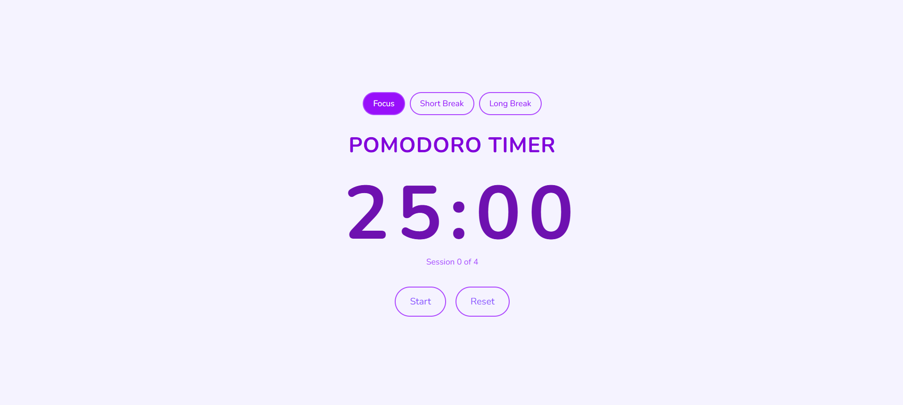

# 🍅 Pomodoro Timer

A productivity timer app built with React, Context API, and Tailwind CSS.



## 🔗 Live Demo
[View on Vercel](https://your-vercel-link.vercel.app)

---

## ✨ Features
- 25-minute focus sessions with 5 and 15-minute breaks
- Start, Pause, and Reset controls
- Auto-stops at 00:00
- Session counter (tracks completed focus sessions)
- Mode switcher — Focus / Short Break / Long Break
- Responsive design with Tailwind CSS

---

## 🛠 Built With
- React (Vite)
- Context API + useReducer — global state management
- useEffect — countdown logic with cleanup
- Tailwind CSS — styling
- Google Fonts (Nunito) — typography

---

## 💡 What I Learned
- How to manage complex state with `useReducer` instead of multiple `useState`
- How to share state across components using Context API (no prop drilling!)
- How to use `useEffect` with `setInterval` and cleanup functions
- Tailwind CSS utility classes and responsive design

---

## 🚀 Getting Started

```bash
# Clone the repo
git clone https://github.com/ryzaaaaamaeeeee/pomodoro-timer.git

# Enter the folder
cd pomodoro-timer

# Install dependencies
npm install

# Run the dev server
npm run dev
```

---

## 📁 Project Structure

```
src/
├── context/
│   └── TimerContext.jsx    # Context API + useReducer
├── components/
│   ├── ModeSelector.jsx    # Focus / Short Break / Long Break tabs
│   ├── TimerDisplay.jsx    # mm:ss countdown display
│   └── TimerControls.jsx   # Start / Pause / Reset buttons
├── App.jsx
├── main.jsx
└── index.css
```

---